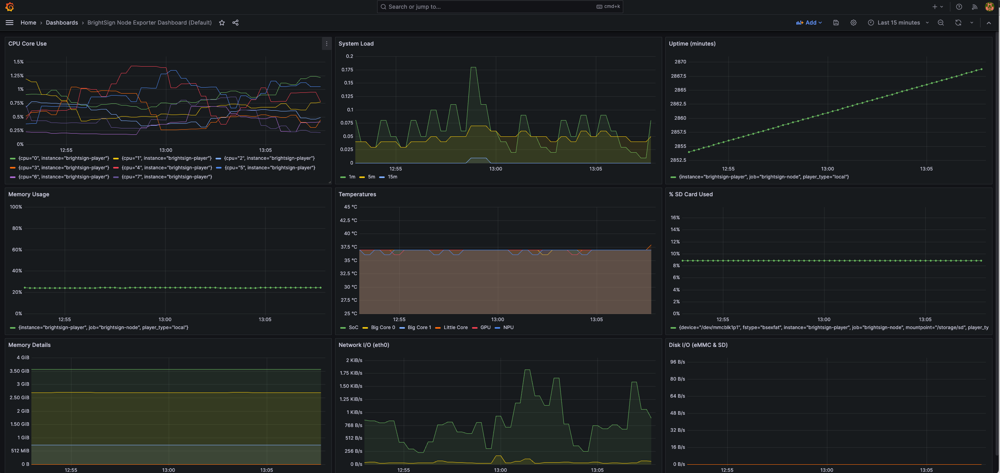

# BrightSign Prometheus + Grafana Demonstration Extension

FOR INTERNAL AND DEMONSTRATION USE ONLY - NOT RECOMMENDED FOR USE ON PRODUCTION PLAYERS

A self-contained Prometheus and Grafana monitoring extension for BrightSign digital signage players. Enables local metrics collection and visualization without external infrastructure.

Useful for internal Engineering testing and for ease of demonstration of "what is possible" using the existing Prometheus Node Exporter capabilities.

<center>

<small>Example Plotted Data in Grafana</small>
</center>

### How to Use

Point your browser at the player:

- **Prometheus**: http://player:9090
- **Grafana**: http://player:3000 (admin/admin)

## What's Included

- **Prometheus 2.48.0** (ARM64) - Metrics collection and storage
- **Grafana 10.2.3** (ARM64) - Dashboard and visualization
- **Pre-configured dashboards** - BrightSign-optimized Node Exporter dashboard
- **Automatic service management** - Starts on boot, survives reboots
- **Registry-based configuration** - Customize ports and behavior via BrightSign registry

## Configuration

The extension supports runtime configuration via BrightSign registry keys:

| Registry Key | Default | Description |
|--------------|---------|-------------|
| `mon-disable-auto-start` | `true` | Set to `false` to prevent auto-start on boot |
| `mon-prometheus-port` | `9090` | Port for Prometheus web interface |
| `mon-grafana-port` | `3000` | Port for Grafana web interface |
| `mon-prometheus-node-exporter-port` | `9100` | Port where Node Exporter is running |

### Configuration Examples

Use these commands to set/change the needed registry settings:

```bash
# Disable auto-start (services won't start on boot)
registry extension mon-disable-auto-start false

# Use custom ports to avoid conflicts
registry extension mon-prometheus-port 9091
registry extension mon-grafana-port 3001
registry extension mon-prometheus-node-exporter-port 9101

# Reset to defaults (remove registry keys)
registry extension mon-disable-auto-start
registry extension mon-prometheus-port
registry extension mon-grafana-port
registry extension mon-prometheus-node-exporter-port

# View current configuration and service status
/var/volatile/bsext/ext_mon/bsext_init status
```

**Note**: Configuration changes require restarting services to take effect:
```bash
/var/volatile/bsext/ext_mon/bsext_init restart
```

## Performance Impact

- **CPU**: ~5-10% during normal operation
- **Memory**: ~150-200MB combined
- **Storage**: ~650MB installed
- **Network**: Local only (no external traffic)

## Default Dashboard

The extension includes a BrightSign-optimized Node Exporter dashboard with **10 monitoring panels** in a 3x3+1 grid layout:

**Row 1 (Top):**
- **CPU Core Use** - Per-core CPU utilization percentages
- **System Load** - 1m, 5m, 15m load averages
- **Uptime (minutes)** - System uptime tracking

**Row 2 (Middle):**
- **Memory Usage** - System memory utilization percentage (0-100%)
- **Temperatures** - All thermal zones (SoC, Big/Little CPU cores, GPU, NPU) with 25-45°C range
- **% SD Card Used** - BrightSign-specific SD card usage percentage

**Row 3 (Bottom):**
- **Memory Details** - Detailed memory breakdown (Total, Available, Cached, Buffers)
- **Network I/O (eth0)** - Ethernet receive/transmit rates
- **Disk I/O (eMMC & SD)** - Read/write metrics for both storage devices

All panels display data as **time-series graphs** for trend analysis with optimized scaling and color-coded thresholds.


## Removal

The easist way to to remove the extension is to do a factory reset.

## Package Information

- **Build Date**: Generated at build time
- **Prometheus**: 2.48.0 (ARM64)
- **Grafana**: 10.2.3 (ARM64)
- **Package Size**: ~200MB compressed, ~650MB installed
- **License**: Apache 2.0 License


## Licensing

This extension is licensed under the Apache 2.0 license as specified [here](./LICENSE.md).

Prometheus is also released under the Apache 2.0 license.

Grafana is released under the [GNU Affero General Public License](https://www.gnu.org/licenses/agpl-3.0.en.html).  Since we are including it as an aggregate and are not extending Grafana those terms are not applicable to this release. This is covered under that license as follows:

```bash
"A compilation of a covered work with other separate and independent works,
which are not by their nature extensions of the covered work, and which are not
combined with it such as to form a larger program, in or on a volume of a storage
or distribution medium, is called an 'aggregate' if the compilation and its
resulting copyright are not used to limit the access or legal rights of the
compilation's users beyond what the individual works permit."
```
